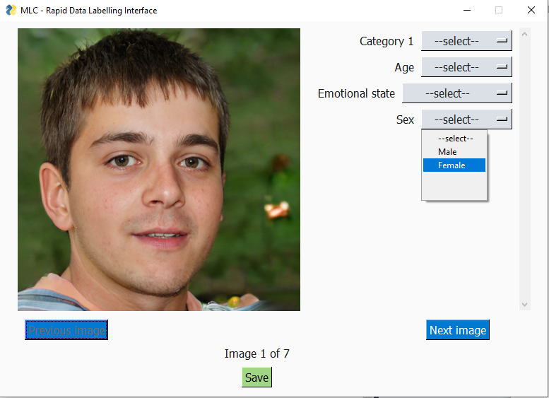
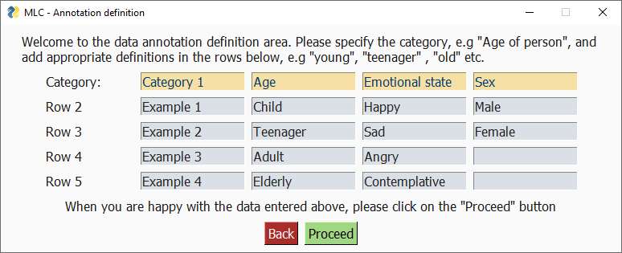
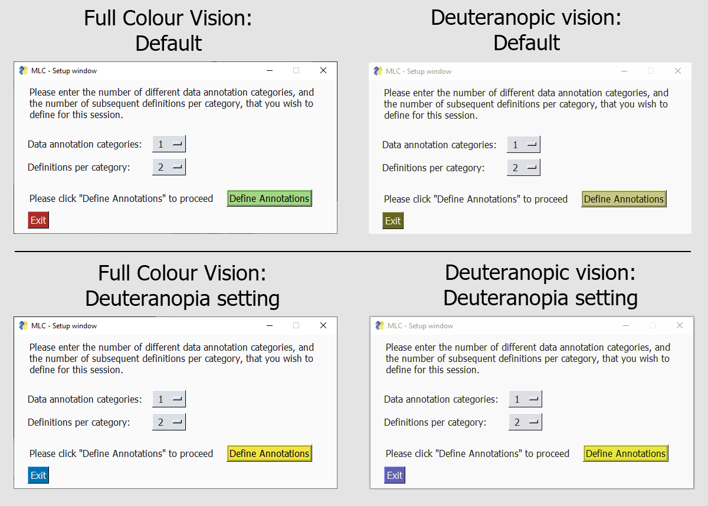

# Rapid-Labelling-Tool
A Python prototype tool for the rapid labeling of visual data to assist in the training of neural networks.

Import your image data, define your annotations, and categorise your images. Output your resultant work in .json and/or .xlsx format.

Define your number of categories and definitions per category, and then input as much (or little) information about each in each entry field

Also featuring basic support for colourblind users: replace the default red-green colour scheme with a high-contrast one.

Basic operation instructions are: first, either add the env folder as a virtual environment in your IDE of choice, or else install the required packages through PIP using requirements.txt. Then run Prototype\_Rapid\_Labelling\_Tool.py . 

Note: The program only accepts input visual data (images) in .jpg file format. 

Submitted in partial fulfillment as part of BSc degree in Engineering with Management, TCD 2020
Daniel Danev
